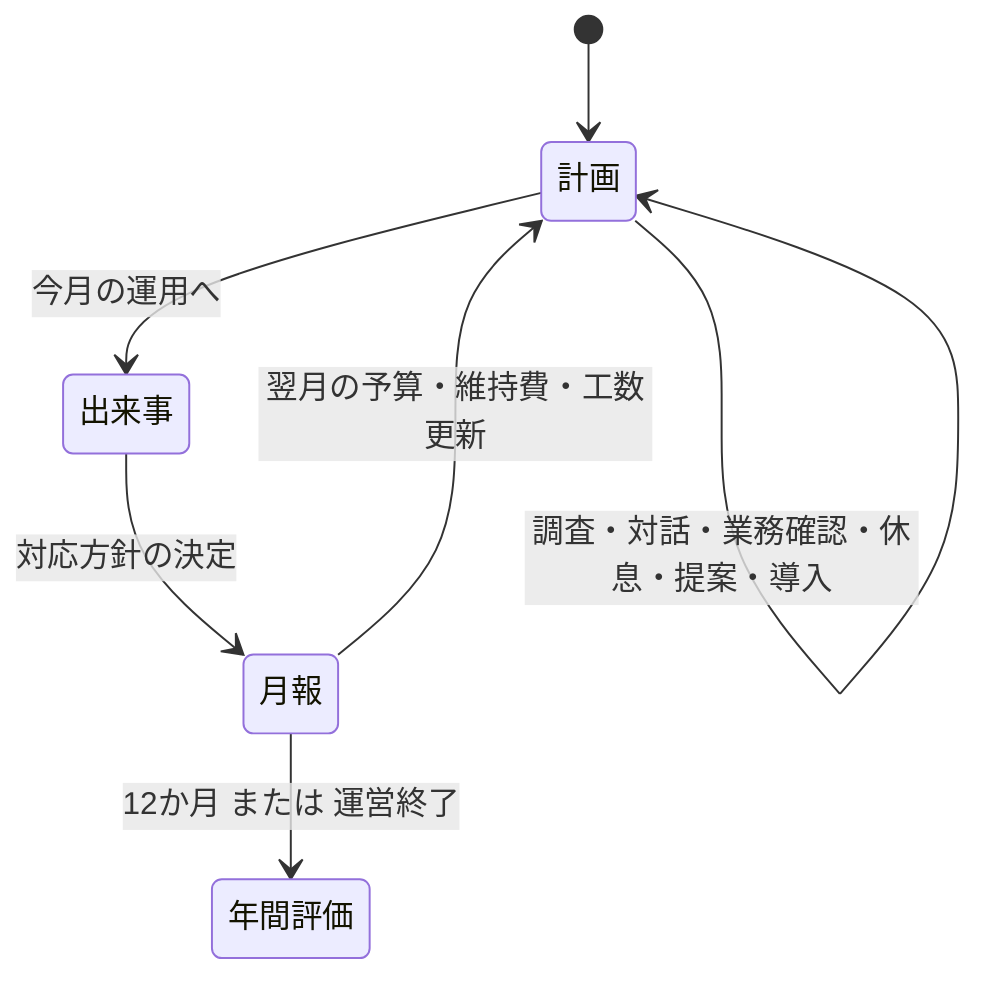

# 情シスの一年 — Unity試作 v0.13

## 今回の目的

「導入したいものが増える / 工数と予算が足りない / 仕組みが育って余裕が生まれる」を、4月から3月まで実際に遊べる形で検証する。
反射神経や知識クイズの正解率ではなく、組織・運用・設備への投資の順番を選ぶ。
完成品ではなく、ゲームの核を確かめる縦断試作。既存版を削除・置換していない。

9/28：ゲーマー・IT初学者・FE取得者を想定した仮想方針で各5年度の画面検証、計450年度のルール計算を実施。[条件・結果・弱点と次の仮説](Persona-Playtest-2026-09-28.md)。実在の人間の試遊・学習効果の測定ではない。この検証ではゲーム本体を変更していない。

### 2026-09-29 v0.13：Next-3

月報・計画の表示8件、状況の把握と時間帯による判断、無料の困りごとの泡、承認済み一枚絵タイトルを実装。旧年度の確定結果の計算は維持し、新年度から判断の追加ルールを適用。未確認の真相は旧保存を含め公開見積もりへ使わない。900年度で限定50.31%・非優越候補平均1.983・完走率差最大2ポイント。実装・撮影・検証の範囲は[Next-3の記録](Next-3-Implementation-2026-09-29.md)。Windows版は据え置き。前段のv0.12で声105本を私的試遊限定で組み込み済み（配布・公開禁止、素材なしでも動く）。

### 2026-09-29 v0.11：Next-Screensの残り

タイトルと共通遷移、依頼書、押せる部屋と設備段階、ランク恩恵を順に実装。新年度の依頼達成は臨時予算1万円。相談文化Cで兆候・Bで見積もり精度、信頼Cで提案・Bで四半期に少額の予算支援。旧年度は追加ルールなしで継続。数値の比較と画面記録は[実装・検証記録](Next-Screens-Remaining-2026-09-29.md)。声はV9-2の枠のみで、無料試聴音声を本番へ投入しない。

### 2026-09-29 手応え追加：Quick-Wins-2

事件の説明札の重なりを解消し、増収コイン、昇降格の文字切替、工数完了、危険の点滅・短い心音、無効ボタンの理由、ホバー・選択の持ち上げ、実際の社員支援の顔マーク、前月比を追加。省演出では新しい動きの位置・拡縮・回転を止める。ルール・報酬・難易度は変更しない。各項目を検証後に個別コミット。[実装・検証・撮影の記録](Quick-Wins-2-Implementation-2026-09-29.md)。

### 2026-09-29 v0.10の仕上げ：事件画面・雨・B案SE

設備名入りの発動札、方針ごとの備え一覧、数字と単位の横並び、最後の未導入設備の点線表示、発動中の設定非表示を実施。6月の雨は青灰色の重ね・雨筋48本・地面の波紋8個へ強化。加藤さんが試聴したB案のSE11音を試遊用に投入し、数値・判子・画面遷移にも割り当てた。ルール・報酬・難易度・旧版は変更しない。[詳細と検証](Incident-Finish-and-Sfx-2026-09-29.md)。

### 2026-09-29 v0.10：共通UI・次画面2

- `UI-Kit.md`を共通窓・ボタン・背景ぼかし・表示の動きへ適用し、初回4月の実操作チュートリアル、月報、年間評価、設定を承認モックの構成へ移行。年間評価のひなたを70px下げる修正は加藤さん承認済み。
- 月報の見積もり・月初と月末の値を保存し、年間の設備MVP・社員支援回数・40件の遭遇数を実際の記録から集計。旧記録の未保存値は「未記録」。図鑑の一覧画面・年度をまたぐ図鑑は未実装。
- 3音量スライダー、文字サイズ、字幕、省演出・割込短縮を即時保存。ひなたの目・口の差分を重ねる仕組みも追加したが、絵とゲーム内ボイスは未投入なので、現在は従来の1枚絵。
- 報酬・難易度の数値ルールは変更していない。未実装の予算+5や新ランクボーナスを、表示だけで付与したように見せない。
- この段階のPlayMode全98/98、その後の最終表示3件各1/1、Verify系・3アセンブリのコンパイル成功。[実装範囲・撮影・未実装](UI-Kit-and-Next2-2026-09-28.md)。[効果音の候補](Sfx-Candidates-2026-09-29.md)は、その後B案が試遊用に選ばれた（上記）。

### 2026-09-28 承認モックの事件画面・季節

- 計画画面に続き、事件の選択と約5秒の設備・社員の発動演出を承認モックへ移行。未確認の札、公開された幅の見積もり、実際の設備効果、確定後の未導入比較を分ける。演出は精算・乱数を追加せず、2回目以降のスキップと省演出にも対応する。
- 計画画面と現在のタイトルへ12か月の季節を追加。②依頼書・報酬、③新タイトル・遷移、⑤部屋の操作、⑥ランク恩恵は未実装。報酬・難易度は変更していない。
- PlayMode89/89、最終表示の対象3件各1/1、Verify系・コンパイル成功。[実装範囲・検証・撮影](Incident-Mock-Migration-2026-09-28.md)。

### 2026-09-28 v0.9の更新

- Claudeの画面評価に沿い、通知をひなたの吹き出し内へ移動。浮遊差分は枠を外して常設差分との二重表示を抑え、下端の補助文を覆わなくした。
- 社員の声・ニュース本文・対応の根拠・採点を必要時の詳細へ移動。月報の翌月収支は純額を表示し、詳しい予算・維持費は詳細に残した。年度結果はランク1文字と6枚の数値カードに変更。数値や学習項目そのものは削除していない。
- 疲労60未満では危険色を使わない。山場の月に凡例を追加し、同じ会社能力の呼び名を統一。3案の決定操作はカード内の明瞭なボタンへ変更。年度結果では文字を横切る粒子を出さない。
- Gemini / Lyriaで生成した通常・トラブルのBGM2曲を同梱。タイトル・計画・月報は通常曲を共有し、対応中に別曲へ切り替える。API通信・課金・キー作成はしていない。[制作・保存・利用条件](CompanyYear-Music-2026-09-28.md)。SEとゲーム内ボイスは従来の状態。
- この修正は従来レイアウトの不具合整理。承認済みの新しい計画画面モックへの移行とは別の作業として先に記録する。

### 2026-09-28 v0.8の更新と確認

- 対応3案を横並びにし、被害・停止時間・対応費を同じ単位で比較。根拠の長文は詳細画面へ分離。未調査の真相は表示しない。計算・バランスは従来と同じ。
- 数値の最終値は即時更新し、増減値だけを短く浮かせる。購入の支出は青、疲労回復は緑、被害や悪化は赤。演出を減らす設定では位置・スケールを動かさず、操作を遮らない。
- 設備導入名・Lvと関連する印の反応、月報の実際の被害・停止記録、社員の確定支援値をオフィスに追加。NPCの作業アニメや設備自体の画像変更ではない。
- 反応36台詞の字幕・表情・音量・割込抑制を実装。ゲームの声とBGMはまだ空。ひなたの描き直し案は不採用で、暫定絵を変更していない。
- PlayMode63/63成功、コンパイル3本とルール検証成功。Windows版を更新し、セーブを読み書きしない検証モードで12か月PASSED。終了時の既存ComputeBuffer解放警告は残る。
- 記録：`Artifacts/company-all-feedback-20260928.json`、`Artifacts/company-player-feedback-20260928.log`、画面40/41。詳細：[演出の実装範囲](Game-Feel-Next-2026-09-28.md)、[音声](Hinata-Voice-2026-09-28.md)。

## 開き方

- Unity: `Assets/Scenes/CompanyYear.unity` を開いてPlay。
- メニュー: `PatchWorkSecure → 新しい試作 → 情シスの一年を開く`。
- Windows試遊版: `Builds/CompanyYear/PatchWorkSecure-Year.exe`。同じフォルダのデータ・DLLも必要。
- バッチ処理後に空シーンが開いた場合も、上記のCompanyYearを明示的に開く。旧版のSampleSceneとは別。

## 最初の一手

今月の相談を読み、社員との対話や調査に工数を使う。右上の「改善計画」で恒久的な整備を選ぶ。
例えば「社員と話す → 追加予算で復旧を約束 → バックアップ導入」で4工数。
別の始め方として、自動化で来月の工数を増やしたり、台帳と手順を先に整えたりできる。
事件への対応費と、翌月以降の維持費も残す。残工数を使い切らず進むことも可能。

## 実装したループ

### v0.7：現実の題材と日常業務

- 従来の月固定12件から、攻撃・不正利用29件＋運用トラブル11件の計40件へ。4月の導入は固定、残りを年度ごとに重複なしで抽選。相談・ニュース・社内依頼・兆候・調査・知識が同じ題材につながる。
- IPA 10大脅威2026の組織向け全10区分、直近のJPCERT/CC注意喚起、公表事例、情シス当事者のブログを参考に、架空の45人企業へ再構成。順位は発生確率として使わない。
- 入退社・権限・問い合わせ・棚卸し等の日常チケット18件を追加。月1件の任意対応で、改善との工数配分を選ぶ。担当社員Lv.2＋引継ぎ手順があれば0工数で任せられる。
- 16種類の効果プロファイル。復元・セッション・MFA・変更障害などで効く備えと対応の配分を変える。設備＋担当者＋社員の加算表示は維持。
- **新しい抽選と日常チケットはニューゲームから**。旧セーブは以前の月固定方式で続ける。年度の抽選結果を保存し、月報には当時の出来事と日常業務の結果を残す。
- [収録範囲・出典・ゲーム化の限界・検証](CompanyYear-Events-2026-09.md)。同時多発の対応やSC全範囲の網羅を実装したものではない。

### v0.6：社員支援・年間の山場・配色の整理

- 9/27追記：本文をZen Kaku Gothic New Medium、見出し・数値・操作をM PLUS Rounded 1c Boldへ変更。窓・カード・ボタンを角丸化し、主要窓に薄い影。[近年の参考例と字体・ライセンスの記録](CompanyYear-Typography-2026-09.md)。この表示変更は続きからでも反映される。
- **新しい育成・季節ルールはニューゲームから**。旧年度は保存時のルールで継続し、過去に経験値や季節負荷を後付けしない。
- 担当者Lv.1〜5、社員3人Lv.1〜3。現場の調査・対話・業務確認や設備整備、月1回1工数の共同練習で成長する。
- 担当者Lv.2で支援方針の指定を解放。おまかせ／日常対応／調査補助／復旧支援から月1回選択。未指定はおまかせ。
- 小川Lv.2＋手順で日常対応を任せ、今月の工数+1。佐伯は調査補助、森は復旧確認・依頼照合を担当。対象と対応が一致したときだけ加算する。
- 社員Lv.3＋手順で、月次対応後に熟練社員から他の社員へ経験+1。佐伯Lv.3＋台帳＋手順で記録整理を強化。実際のフォレンジック操作を再現したものではない。
- 対応前と月報に「設備・運用＋担当者＋社員」の抑制力を表示。解決後に上がったレベルは次の仕事から有効。設備Lvは整備段階の目安で、無条件の追加ボーナスではない。
- 6・9・12月の山場と3月の総力対応に季節負荷。7・10・1月は直前より負荷が下がる。プレイヤーのレベルを見て敵を強くする仕組みではない。
- 6・9・12月の完了報酬は改善予算+10万円、または翌月限定+1工数。未選択の自動進行では予算を選ぶ。
- UIはチャコール・白・青へ変更。黄みのある白、金色の常用、広いパステル色の面を廃止。ステータスは縁とゲージを色分けし、数値は白、危険時は赤。共同練習の文字切れと対応ボタンの加算値省略も修正。
- [実装範囲と検証記録](CompanyYear-v0.6-Review.md)。社員45人全員の自律行動、複数事件の同時進行、完成した手描き素材・BGMは未実装。

### v0.5：仮想試遊から修正した判断・育成

- 左の成長目標をクリックすると、連携の必要設備・現在レベル・次の費用・具体的な効果を確認でき、そのまま導入計画へ進める。
- バックアップ＋復元訓練の「復元連携」、自動化＋引継ぎ手順の「再開連携」。対応方針と対象の出来事が合う時に効果が増える。
- 購入前の比較は「広範囲の停止」「対象を限定」「復旧を優先」の3方式を切り替え可能。隠された真相ではなく、公開予測を比較する。
- 月報の「効いた整備・連携を見る」で、設備を一つだけ外した場合の被害・停止の差を確認。連携があるので行の合計は総効果にならないと明記。
- バックアップが混雑に効く等の誤った因果を修正。全方針で基本の封じ込め・安全確認は行い、重点配分を選ぶと明示。
- 追加予算の約束未達は、信頼低下に加えて交付額を全額返却。新しい提案から適用。旧記録で交付額が未保存の提案については返却額を捏造しない。
- 休暇月の当番調整は通常の休息も兼ねる。通常の休息ボタンからも同じ効果で、重複不可。
- 教育＋相談文化65で、経理の森さんの相談が変わる。全社員の個別育成を実装したわけではない。
- 旧セーブは読める。過去の結果は書き換えず、設備別の内訳がなければ未記録と表示。新しい連携計算・対象範囲・休息の修正は次の対応から反映する。
- [仮想評価・試遊・トレンド追加調査](Playtest-Review-2026-09-26.md)に、判断規則、変更前後の結果、残る弱点を記録。

### v0.4で追加した判断と手応え

- ステータスを項目別に色分け。項目名・単位・状態の短い説明・直前の行動による増減を表示。クリックで意味と改善方法を確認できる。疲労は低いほど良いと明示。
- 5月以降に4種類の社内事情を追加。納期集中は停止に伴う追加損失（最大6万円）、担当者休暇は追加疲労（最大8）。1工数の事前調整で防げる。引継ぎ手順でも休暇時の負担を軽減できる。
- 合同メンテナンスは復旧分野の整備 -1工数（最低1）、導入支援は防御分野 -4万円。維持費・前提条件は変えない。購入比較にも割引を反映。
- 4月は通常運用。事情の順番は年度シードから決まり、4種類を一巡する。保存復帰で変わらない。以前のセーブは旧ルールのまま継続し、新規年度だけ追加ルールを使う。
- 操作・行動・購入・成長・警告・成功・被害・月替わり・クリア・運営終了の10用途に試作効果音を分離。押し込み・フォーカス枠・数値強調・達成粒子・被害時の小さな揺れを追加。
- 「記録 / 設定」またはタイトルの「音・演出の設定」から、消音・音量・動きの低減・3種類の試聴ができる。設定は保存される。演出中も操作できる。
- `Assets/CompanyOps/YearSounds.asset` に差し替え用SE10枠、BGM4枠を集約。未設定SEは独自の合成音で鳴る。BGM素材は未投入。場面切替時の約0.8秒クロスフェードを用意。
- [ゲーム体験・UI・音の研究](Game-Experience-Research-2026-09.md)を追加。人気作の仕組みと、この試作の弱点・次の実験を分けて整理。

### v0.3で追加したゲーム体験

- 12か月それぞれに社内依頼を設定。設備を整える道と、今月の調査・対話など現場で解く道のどちらでも達成できる。依頼は必須ではなく、月内に達成すると経営の信頼 +3、年間得点 +45。
- 進行画面下の社内依頼カードに二つの道の進捗を表示。事件開始時に依頼達成を判定し、月報と年間評価にも結果を残す。オフィス上の区画ラベルから関連する改善計画を開ける。
- 年間得点は被害・停止で減り、社内依頼・成長目標・会社の能力・残予算で増える。ランクA/B/Cの基準を得点に変更。年間評価に内訳を表示。
- 事件画面の3対応を中立な見た目に統一。どれか一つを「正解」に見せない。事件発生時にはオフィス画面を警戒色にし、行動・達成・被害の通知を拡大して短く表示。
- 既存の `company-ops-year-v1.json` 形式と保存先を維持。以前のセーブに社内依頼の記録がなくても読める。

### v0.2で追加した判断材料

- 購入確認に、導入前後の予算・残工数・毎月の維持費・翌月の工数・会社の能力を表示。
- 今月の「対象を限定して対応」について、導入前後の被害・停止の予測を比較。未調査の真値は表示しない。
- 月報に設備・運用整備で削減した被害額と停止時間を表示。同じ事件・対応・相談文化・疲労・当月の確認行動のまま、全設備Lv.0と比較したゲーム内の差分。
- この比較は対策費を回収できたという意味ではない。投資額・維持費・対応費は別途必要。社員との対話そのものの効果も差分には含めない。
- 比較用に状態をコピーするため、購入前に開くだけで工数・予算・知識・成長報酬が増減しない。
- 旧v0.1セーブは引き続き読める。比較を保存していない過去の月報には、比較記録がない旨を表示。

### 進行

- 毎月違う相談・架空ニュース・出来事を12か月分。
- 11種類の改善、各2段階。前提条件、導入費、工数、維持費を持つ。
- 自動化は翌月の工数を増やし、教育は相談文化を育てる。
- 調査は予測の幅と限定対応の精度を改善。業務確認は停止時間を減らす。
- 追加予算は調査・対話等の根拠が必要。提案後に約束した分野を整備すると信頼上昇、未達で低下。
- 予防・影響限定・復旧を分けた結果計算。バックアップは侵入自体を防がない。
- 年度シードで深刻度・正常な活動だったかを固定。保存復帰で事件を引き直さない。
- 3つの会社の成長目標。一度だけ信頼報酬。月報、年間評価、月別履歴。
- 自動保存、続きから、前回保存の `.bak`。操作音の消音、Escでメニュー/閉じる。
- 知識カード14項目。読むための工数や強制クイズはない。

## 表示と素材

UI文言は「年度終了」「対応完了」「今月の結果」のように状態・操作を直接示す。読点で情緒を演出するキャッチコピーは使わない。

1600×900を基準に、1280×720でも同じ配置を縮小して表示する。極端に細長い画面は余白が付く。
オフィス背景は既存の暫定素材を再利用。成長に応じてマップ上の設備表示が変わる。
ひなたは既存Personaから名前と仕事着の暫定立ち絵を読み、タイトルと会話欄に表示する。`Assets/Sprites/Hinata/hinata_normal.png` は生成画像を元に透過・衣装修正した既存素材で、最終的な手描き原画ではない。新規のキャラ絵は作っていない。
社員の歩行AI、家具配置、環境アニメーション、専用BGMは未実装。効果音は用途別に作った試作の合成音で、最終音源ではない。
TMPの動的日本語フォントを使用し、数値には常に項目名を表示する。絵文字は使わない。

## 検証の入口

- `Tools/Verify-CompanyOps.ps1`: 従来の固定年度・成長ルールの検証に加え、新しい抽選年度4方針×300年と境界条件を検証。
- `Assets/Tests/CompanyOpsTests.cs`: 保存・復帰、予算の約束、前提、二重操作、因果、成長報酬、クリックの遮蔽、実際の12か月進行。
- Unity PlayModeテストは旧版のテストも含めて実行する。
- 実画面のスクリーンショット: `Artifacts/CompanyOps/`。
- 結果: `Artifacts/company-tests.xml`、ビルドログ: `Artifacts/company-player.log`。
- Windows実行版の検証: `-batchmode -ops-smoke-test -logFile <ログの絶対パス>`。検証引数付きの時だけ12か月を自動進行して終了し、利用者のセーブは触らない。

### 2026-09-23 の確認結果

- Unity PlayMode: **22件中22件成功**。旧版の9件も含む。購入比較、社内依頼の二つの達成方法・重複報酬の防止・古い保存データとの互換性、ひなたの表示、オフィスからの改善計画への移動を検証。
- 1600×900のタイトル・計画・購入確認・事件・月報・年間評価・月別履歴を描画し、画像で確認。1280×720でも撮影。
- 主要見出し・数値の欠け、日本語グリフ警告、購入・予算提案・対応ボタンのクリック遮蔽をテスト。
- 保存ファイルの実書込み・読戻し・前回保存バックアップ・破損時に元ファイルを保持する動作を確認。
- Windows Standaloneビルド成功。ビルドした実行ファイルでも12か月の自動通し検証 **PASSED**、終了コード0。
- Windows実行版の通し検証で12か月 `PASSED`、終了コード0。ゲームの例外・文字欠け警告なし。終了時に `ComputeBuffer` の解放警告が残り、発生元は未特定。ログは `Artifacts/company-player-smoke.log`。
- 人間の初見プレイによる楽しさ・操作感の評価は未実施。画面上の想定プレイ時間は計測値ではない。

自動方針で一年を完走できることは、面白さの証明ではない。
300年ずつの検証は、放置97/300、運用重視300/300、組織重視300/300。
平均得点は放置0、運用重視1449、組織重視1274。社内依頼の平均達成数は順に0、9、8。
この試作は熟練者向け難度ではない。初見で「欲しい改善があるか」「選ぶ理由が生まれるか」を優先して試す。

### 2026-09-26 v0.4の確認結果

- Unity PlayMode **29件中29件成功**。旧版9件を含む。新しい月次事情、割引と実支払の一致、事前調整、旧セーブ互換、音の波形、UIの押下・低減設定を追加検証。
- 実画面17枚を撮影。ステータス詳細・演出設定・月次事情を目視確認。1280×720の警告表示と主要ラベルのはみ出し、クリック遮蔽、文字欠け警告を検証。
- 音は波形の振幅・有限値・用途ごとの違いと再生経路を確認。テストではAudioSourceを消音し、利用者の音量・セーブを変更しない。人間による音色の聴き比べ・長時間の聴覚疲労は未評価。
- 3方針×300年：放置91/300、運用重視300/300、組織重視300/300。平均得点は0 / 1392 / 1223、依頼達成平均は0 / 8 / 7。難度や楽しさの完成を意味しない。
- Windows試遊版を再構築し、更新後の実行版でも12か月 **PASSED**、終了コード0。ゲームの例外・文字欠け警告なし。終了時の既存 `ComputeBuffer` 解放警告は残る。ビルド時にもUnityのライセンス検証警告が記録されたが、ビルド結果は成功。

### 2026-09-26 v0.5の確認結果

- Unity PlayMode **37件中37件成功**（旧版9件を含む）。連携の適用範囲、非侵入防止、正常時、設備別差分、保存復帰、追加予算返却、休息の重複防止、社員の相談変化を追加検証。
- 連携計画→導入確認→方針切替→購入→事件→月報内訳まで実画面のボタンから操作。1280×720の連携成立・設備別リストを含め、画像23枚を出力。文字欠け警告・重要文字のはみ出し・主要ボタンの遮蔽を検証。
- 純粋C#で年間3,400回（3方針×300＋5方針×500）、序盤3か月1,000回（2方針×500）。非公開の事件情報を行動選択に使わない。数値結果と限界は別の[試遊記録](Playtest-Review-2026-09-26.md)に保存。
- AIの専門観点レビュー2役と仮想プレイによる検証。人間の初見試遊・専門家による認証ではない。
- Windows版を更新し、実行版でも12か月 **PASSED**・終了コード0。ゲーム例外・日本語グリフ警告なし。Unityのライセンス検証警告と、実行版終了時の既存ComputeBuffer解放警告は残る。

## 学習モデルの限界

ニュース・予算・被害・停止時間は架空。対策の現実の効果を、ゲームの整数加算で表したものと解釈しない。
毎月1件の出来事に簡略化している。継続調査、証拠保全、法的通知、顧客への説明、復旧後の監視等を網羅する実務手順ではない。
SCレベルの学習へ広げる入口は用意したが、現時点でSC試験範囲を網羅していない。

概念確認の一次資料:

- [NIST Cybersecurity Framework](https://www.nist.gov/cyberframework): 識別・防御・検知・対応・復旧等を分けて考える枠組み。
- [IPA 情報処理技術者試験・情報処理安全確保支援士試験](https://www.ipa.go.jp/shiken/): 正式な試験範囲・資料の確認先。

## 開発上の分離

2026-09-28：計画画面だけを承認済みHTMLモックへ移行。手順・実データの対応・82件のPlayMode結果・比較画像は[移行記録](Planning-Mock-Migration-2026-09-28.md)。ゲームのルールと他フェーズのデザインは維持。更新したWindows版も12か月とBGM2曲の確認が成功。

`OpsCatalog` → `OpsState` → `OpsGame`、保存は `OpsSaveStore`。旧版の `GameState` は変更しない。
`CompanyOpsSceneBuilder` が別のシーンとButtonプレハブを保存して生成する。
`Prototype/CompanyOps/data.js` は初期資料。現在のマスタはC#側。二重編集しない。

Unity CLIは `C:/Program Files/Unity Hub/resources/cli/unity.exe`、導入したPipelineは `0.7.0-exp.1`。
このプロジェクトの起動中EditorをCLIから読み取れることを確認。ログイン情報や接続トークンは資料に保存しない。
Pipelineは実験版。ゲーム実行自体は外部サービスへ接続せず成立する。

## Unity公式Skills

[Unity公式プラグイン](https://github.com/Unity-Technologies/unity-agent-plugin)の `unity@unity-agent-plugin`、`0.1.6-beta` をCodexへ導入・有効化。
取得時コミットは `ba48956ae8bee4ef8a3ef3d75dec03c16aa5cc89`。
Unityプロジェクトへ入れるパッケージではなく、開発エージェント向けの手順集。既存のUnity CLI / Pipelineとは別のもの。
今回の購入比較・月報は `ui` / `ui-ugui` の既存構成優先・局所変更・クリック遮蔽確認を適用。UI Toolkitへの移行、広告・課金・外部サービスの導入は行っていない。
新しく開始するCodexセッションからプラグインのスキル一覧に反映される。今回は公式の手順ファイルを直接読み込んで使用した。
