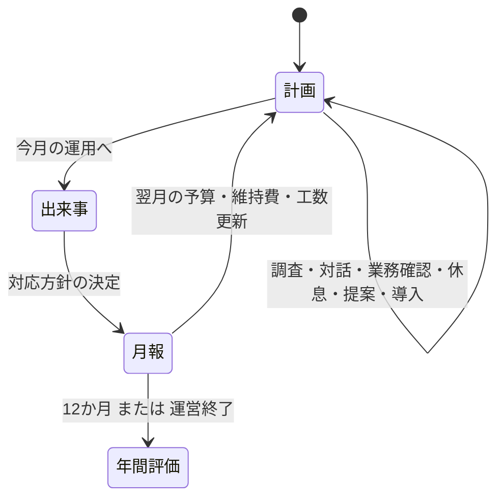

# 情シスの一年 — Unity試作 v0.5

## 今回の目的

「導入したいものが増える / 工数と予算が足りない / 仕組みが育って余裕が生まれる」を、4月から3月まで実際に遊べる形で検証する。
反射神経や知識クイズの正解率ではなく、組織・運用・設備への投資の順番を選ぶ。
完成品ではなく、ゲームの核を確かめる縦断試作。既存版を削除・置換していない。

## 開き方

- Unity: `Assets/Scenes/CompanyYear.unity` を開いてPlay。
- メニュー: `PatchWorkSecure → 新しい試作 → 情シスの一年を開く`。
- Windows試遊版: `Builds/CompanyYear/PatchWorkSecure-Year.exe`。同じフォルダのデータ・DLLも必要。
- バッチ処理後に空シーンが開いた場合も、上記のCompanyYearを明示的に開く。旧版のSampleSceneとは別。

## 最初の一手

今月の相談を読み、社員との対話や調査に工数を使う。右上の「改善計画」で恒久的な整備を選ぶ。
例えば「社員と話す → 追加予算で復旧を約束 → バックアップ導入」で4工数。
別の始め方として、自動化で来月の工数を増やしたり、台帳と手順を先に整えたりできる。
事件への対応費と、翌月以降の維持費も残す。残工数を使い切らず進むことも可能。

## 実装したループ

### v0.5：仮想試遊から修正した判断・育成

- 左の成長目標をクリックすると、連携の必要設備・現在レベル・次の費用・具体的な効果を確認でき、そのまま導入計画へ進める。
- バックアップ＋復元訓練の「復元連携」、自動化＋引継ぎ手順の「再開連携」。対応方針と対象の出来事が合う時に効果が増える。
- 購入前の比較は「広範囲の停止」「対象を限定」「復旧を優先」の3方式を切り替え可能。隠された真相ではなく、公開予測を比較する。
- 月報の「効いた整備・連携を見る」で、設備を一つだけ外した場合の被害・停止の差を確認。連携があるので行の合計は総効果にならないと明記。
- バックアップが混雑に効く等の誤った因果を修正。全方針で基本の封じ込め・安全確認は行い、重点配分を選ぶと明示。
- 追加予算の約束未達は、信頼低下に加えて交付額を全額返却。新しい提案から適用。旧記録で交付額が未保存の提案については返却額を捏造しない。
- 休暇月の当番調整は通常の休息も兼ねる。通常の休息ボタンからも同じ効果で、重複不可。
- 教育＋相談文化65で、経理の森さんの相談が変わる。全社員の個別育成を実装したわけではない。
- 旧セーブは読める。過去の結果は書き換えず、設備別の内訳がなければ未記録と表示。新しい連携計算・対象範囲・休息の修正は次の対応から反映する。
- [仮想評価・試遊・トレンド追加調査](Playtest-Review-2026-09-26.md)に、判断規則、変更前後の結果、残る弱点を記録。

### v0.4で追加した判断と手応え

- ステータスを項目別に色分け。項目名・単位・状態の短い説明・直前の行動による増減を表示。クリックで意味と改善方法を確認できる。疲労は低いほど良いと明示。
- 5月以降に4種類の社内事情を追加。納期集中は停止に伴う追加損失（最大6万円）、担当者休暇は追加疲労（最大8）。1工数の事前調整で防げる。引継ぎ手順でも休暇時の負担を軽減できる。
- 合同メンテナンスは復旧分野の整備 -1工数（最低1）、導入支援は防御分野 -4万円。維持費・前提条件は変えない。購入比較にも割引を反映。
- 4月は通常運用。事情の順番は年度シードから決まり、4種類を一巡する。保存復帰で変わらない。以前のセーブは旧ルールのまま継続し、新規年度だけ追加ルールを使う。
- 操作・行動・購入・成長・警告・成功・被害・月替わり・クリア・運営終了の10用途に試作効果音を分離。押し込み・フォーカス枠・数値強調・達成粒子・被害時の小さな揺れを追加。
- 「記録 / 設定」またはタイトルの「音・演出の設定」から、消音・音量・動きの低減・3種類の試聴ができる。設定は保存される。演出中も操作できる。
- `Assets/CompanyOps/YearSounds.asset` に差し替え用SE10枠、BGM4枠を集約。未設定SEは独自の合成音で鳴る。BGM素材は未投入。場面切替時の約0.8秒クロスフェードを用意。
- [ゲーム体験・UI・音の研究](Game-Experience-Research-2026-09.md)を追加。人気作の仕組みと、この試作の弱点・次の実験を分けて整理。

### v0.3で追加したゲーム体験

- 12か月それぞれに社内依頼を設定。設備を整える道と、今月の調査・対話など現場で解く道のどちらでも達成できる。依頼は必須ではなく、月内に達成すると経営の信頼 +3、年間得点 +45。
- 進行画面下の社内依頼カードに二つの道の進捗を表示。事件開始時に依頼達成を判定し、月報と年間評価にも結果を残す。オフィス上の区画ラベルから関連する改善計画を開ける。
- 年間得点は被害・停止で減り、社内依頼・成長目標・会社の能力・残予算で増える。ランクA/B/Cの基準を得点に変更。年間評価に内訳を表示。
- 事件画面の3対応を中立な見た目に統一。どれか一つを「正解」に見せない。事件発生時にはオフィス画面を警戒色にし、行動・達成・被害の通知を拡大して短く表示。
- 既存の `company-ops-year-v1.json` 形式と保存先を維持。以前のセーブに社内依頼の記録がなくても読める。

### v0.2で追加した判断材料

- 購入確認に、導入前後の予算・残工数・毎月の維持費・翌月の工数・会社の能力を表示。
- 今月の「対象を限定して対応」について、導入前後の被害・停止の予測を比較。未調査の真値は表示しない。
- 月報に設備・運用整備で削減した被害額と停止時間を表示。同じ事件・対応・相談文化・疲労・当月の確認行動のまま、全設備Lv.0と比較したゲーム内の差分。
- この比較は対策費を回収できたという意味ではない。投資額・維持費・対応費は別途必要。社員との対話そのものの効果も差分には含めない。
- 比較用に状態をコピーするため、購入前に開くだけで工数・予算・知識・成長報酬が増減しない。
- 旧v0.1セーブは引き続き読める。比較を保存していない過去の月報には、比較記録がない旨を表示。

### 進行

- 毎月違う相談・架空ニュース・出来事を12か月分。
- 11種類の改善、各2段階。前提条件、導入費、工数、維持費を持つ。
- 自動化は翌月の工数を増やし、教育は相談文化を育てる。
- 調査は予測の幅と限定対応の精度を改善。業務確認は停止時間を減らす。
- 追加予算は調査・対話等の根拠が必要。提案後に約束した分野を整備すると信頼上昇、未達で低下。
- 予防・影響限定・復旧を分けた結果計算。バックアップは侵入自体を防がない。
- 年度シードで深刻度・正常な活動だったかを固定。保存復帰で事件を引き直さない。
- 3つの会社の成長目標。一度だけ信頼報酬。月報、年間評価、月別履歴。
- 自動保存、続きから、前回保存の `.bak`。操作音の消音、Escでメニュー/閉じる。
- 知識カード14項目。読むための工数や強制クイズはない。

## 表示と素材

UI文言は「年度終了」「対応完了」「今月の結果」のように状態・操作を直接示す。読点で情緒を演出するキャッチコピーは使わない。

1600×900を基準に、1280×720でも同じ配置を縮小して表示する。極端に細長い画面は余白が付く。
オフィス背景は既存の暫定素材を再利用。成長に応じてマップ上の設備表示が変わる。
ひなたは既存Personaから名前と仕事着の暫定立ち絵を読み、タイトルと会話欄に表示する。`Assets/Sprites/Hinata/hinata_normal.png` は生成画像を元に透過・衣装修正した既存素材で、最終的な手描き原画ではない。新規のキャラ絵は作っていない。
社員の歩行AI、家具配置、環境アニメーション、専用BGMは未実装。効果音は用途別に作った試作の合成音で、最終音源ではない。
TMPの動的日本語フォントを使用し、数値には常に項目名を表示する。絵文字は使わない。

## 検証の入口

- `Tools/Verify-CompanyOps.ps1`: 従来3方針×300年に加え、5方針×500年、序盤3か月の2方針×500回と境界条件を検証。
- `Assets/Tests/CompanyOpsTests.cs`: 保存・復帰、予算の約束、前提、二重操作、因果、成長報酬、クリックの遮蔽、実際の12か月進行。
- Unity PlayModeテストは旧版のテストも含めて実行する。
- 実画面のスクリーンショット: `Artifacts/CompanyOps/`。
- 結果: `Artifacts/company-tests.xml`、ビルドログ: `Artifacts/company-player.log`。
- Windows実行版の検証: `-batchmode -ops-smoke-test -logFile <ログの絶対パス>`。検証引数付きの時だけ12か月を自動進行して終了し、利用者のセーブは触らない。

### 2026-09-23 の確認結果

- Unity PlayMode: **22件中22件成功**。旧版の9件も含む。購入比較、社内依頼の二つの達成方法・重複報酬の防止・古い保存データとの互換性、ひなたの表示、オフィスからの改善計画への移動を検証。
- 1600×900のタイトル・計画・購入確認・事件・月報・年間評価・月別履歴を描画し、画像で確認。1280×720でも撮影。
- 主要見出し・数値の欠け、日本語グリフ警告、購入・予算提案・対応ボタンのクリック遮蔽をテスト。
- 保存ファイルの実書込み・読戻し・前回保存バックアップ・破損時に元ファイルを保持する動作を確認。
- Windows Standaloneビルド成功。ビルドした実行ファイルでも12か月の自動通し検証 **PASSED**、終了コード0。
- Windows実行版の通し検証で12か月 `PASSED`、終了コード0。ゲームの例外・文字欠け警告なし。終了時に `ComputeBuffer` の解放警告が残り、発生元は未特定。ログは `Artifacts/company-player-smoke.log`。
- 人間の初見プレイによる楽しさ・操作感の評価は未実施。画面上の想定プレイ時間は計測値ではない。

自動方針で一年を完走できることは、面白さの証明ではない。
300年ずつの検証は、放置97/300、運用重視300/300、組織重視300/300。
平均得点は放置0、運用重視1449、組織重視1274。社内依頼の平均達成数は順に0、9、8。
この試作は熟練者向け難度ではない。初見で「欲しい改善があるか」「選ぶ理由が生まれるか」を優先して試す。

### 2026-09-26 v0.4の確認結果

- Unity PlayMode **29件中29件成功**。旧版9件を含む。新しい月次事情、割引と実支払の一致、事前調整、旧セーブ互換、音の波形、UIの押下・低減設定を追加検証。
- 実画面17枚を撮影。ステータス詳細・演出設定・月次事情を目視確認。1280×720の警告表示と主要ラベルのはみ出し、クリック遮蔽、文字欠け警告を検証。
- 音は波形の振幅・有限値・用途ごとの違いと再生経路を確認。テストではAudioSourceを消音し、利用者の音量・セーブを変更しない。人間による音色の聴き比べ・長時間の聴覚疲労は未評価。
- 3方針×300年：放置91/300、運用重視300/300、組織重視300/300。平均得点は0 / 1392 / 1223、依頼達成平均は0 / 8 / 7。難度や楽しさの完成を意味しない。
- Windows試遊版を再構築し、更新後の実行版でも12か月 **PASSED**、終了コード0。ゲームの例外・文字欠け警告なし。終了時の既存 `ComputeBuffer` 解放警告は残る。ビルド時にもUnityのライセンス検証警告が記録されたが、ビルド結果は成功。

### 2026-09-26 v0.5の確認結果

- Unity PlayMode **37件中37件成功**（旧版9件を含む）。連携の適用範囲、非侵入防止、正常時、設備別差分、保存復帰、追加予算返却、休息の重複防止、社員の相談変化を追加検証。
- 連携計画→導入確認→方針切替→購入→事件→月報内訳まで実画面のボタンから操作。1280×720の連携成立・設備別リストを含め、画像23枚を出力。文字欠け警告・重要文字のはみ出し・主要ボタンの遮蔽を検証。
- 純粋C#で年間3,400回（3方針×300＋5方針×500）、序盤3か月1,000回（2方針×500）。非公開の事件情報を行動選択に使わない。数値結果と限界は別の[試遊記録](Playtest-Review-2026-09-26.md)に保存。
- AIの専門観点レビュー2役と仮想プレイによる検証。人間の初見試遊・専門家による認証ではない。
- Windows版を更新し、実行版でも12か月 **PASSED**・終了コード0。ゲーム例外・日本語グリフ警告なし。Unityのライセンス検証警告と、実行版終了時の既存ComputeBuffer解放警告は残る。

## 学習モデルの限界

ニュース・予算・被害・停止時間は架空。対策の現実の効果を、ゲームの整数加算で表したものと解釈しない。
毎月1件の出来事に簡略化している。継続調査、証拠保全、法的通知、顧客への説明、復旧後の監視等を網羅する実務手順ではない。
SCレベルの学習へ広げる入口は用意したが、現時点でSC試験範囲を網羅していない。

概念確認の一次資料:

- [NIST Cybersecurity Framework](https://www.nist.gov/cyberframework): 識別・防御・検知・対応・復旧等を分けて考える枠組み。
- [IPA 情報処理技術者試験・情報処理安全確保支援士試験](https://www.ipa.go.jp/shiken/): 正式な試験範囲・資料の確認先。

## 開発上の分離

`OpsCatalog` → `OpsState` → `OpsGame`、保存は `OpsSaveStore`。旧版の `GameState` は変更しない。
`CompanyOpsSceneBuilder` が別のシーンとButtonプレハブを保存して生成する。
`Prototype/CompanyOps/data.js` は初期資料。現在のマスタはC#側。二重編集しない。

Unity CLIは `C:/Program Files/Unity Hub/resources/cli/unity.exe`、導入したPipelineは `0.7.0-exp.1`。
このプロジェクトの起動中EditorをCLIから読み取れることを確認。ログイン情報や接続トークンは資料に保存しない。
Pipelineは実験版。ゲーム実行自体は外部サービスへ接続せず成立する。

## Unity公式Skills

[Unity公式プラグイン](https://github.com/Unity-Technologies/unity-agent-plugin)の `unity@unity-agent-plugin`、`0.1.6-beta` をCodexへ導入・有効化。
取得時コミットは `ba48956ae8bee4ef8a3ef3d75dec03c16aa5cc89`。
Unityプロジェクトへ入れるパッケージではなく、開発エージェント向けの手順集。既存のUnity CLI / Pipelineとは別のもの。
今回の購入比較・月報は `ui` / `ui-ugui` の既存構成優先・局所変更・クリック遮蔽確認を適用。UI Toolkitへの移行、広告・課金・外部サービスの導入は行っていない。
新しく開始するCodexセッションからプラグインのスキル一覧に反映される。今回は公式の手順ファイルを直接読み込んで使用した。
