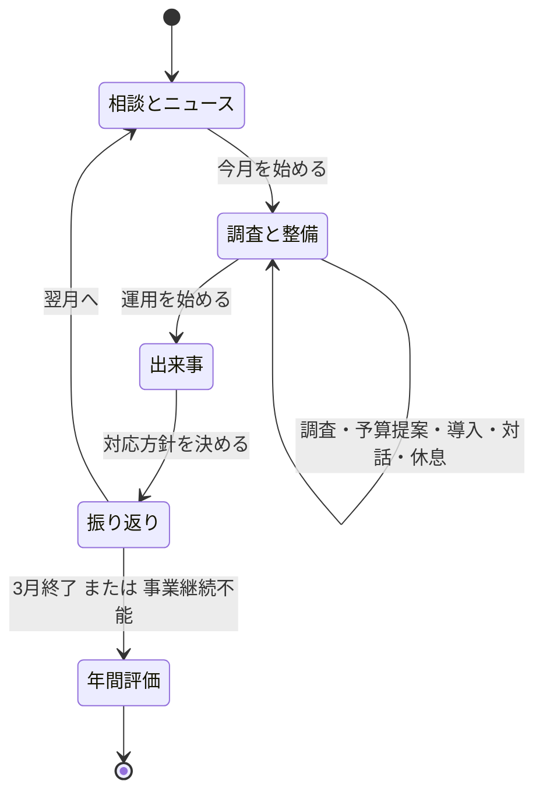
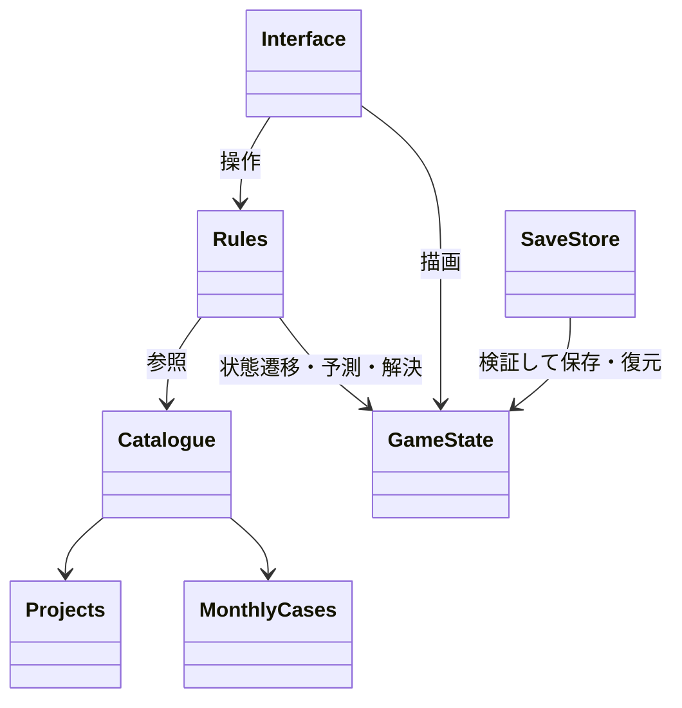

# PatchWork Secure / 会社を育てる一年

## 今回の判断

網羅的なUMLから始めず、短い設計と操作可能な試作を同時に作る。
2026-09-21の方針変更で、ブラウザ実装ではなくUnityの独立シーン `Assets/Scenes/CompanyYear.unity` に実装した。
既存の `SampleScene` とそのゲームルールは残す。このフォルダの `data.js` は初期設計の資料で、実行時には使用しない。
現在の遊び方・制約は `Docs/CompanyYear-Prototype.md` を参照。

## 検証する楽しさ

「導入したいものがある → 工数と予算を作る → 会社の運用が変わる → 次の改善がしたくなる」。
社員・仕組み・経営層の協力を育て、4月から3月まで会社を支える。
反射神経・毎回同じ対応3択・隠れた成功率抽選を中心にしない。

## 一年の流れ

## 最小構成

- 12か月、月ごとの上層部の相談・現場の声・架空ニュース。
- 予算・工数・業務の安定・社員の相談文化・経営の信頼・負担。
- 設備だけでなく、台帳・復元訓練・教育・手順書・自動化など11種類の恒久改善。
- 対策の前提、継続費、月をまたぐ効果。自動化は使える工数を増やす。
- 調査は工数を使って証拠を得る。証拠付きの予算提案には、今月実行する約束が伴う。
- 月の出来事は開始時の固定シードから決まり、セーブの読み直しで引き直せない。
- 予測には未調査部分の幅が残る。決断後に結果を都合よく再抽選しない。
- 侵入の予防、早期検知、影響限定、復旧、業務継続を別々に計算する。バックアップを侵入阻止扱いしない。
- 月報で「何が効いたか」「何が不足したか」と社員の反応を返す。3軸の成熟度を評価。
- 自動保存・続きから・直前保存のバックアップ。任意に開く知識カード。手動のインポート/エクスポートUIは未実装。

## 責務

`OpsCatalog.cs` は内容、`OpsState.cs` はUnityに依存しないルール、`OpsGame` は画面、`OpsSaveStore` は保存。
`CompanyOpsSceneBuilder` が独立シーンと選択肢プレハブを生成する。
純粋C#の年間シミュレーションとUnityのPlayMode通しテストを分ける。

## 学習上の境界

用語の意味は事実、ゲーム内のコスト・効果量・事件頻度は架空の設計値。
資格試験の網羅教材や実システムの対応手順とは扱わない。
現実の対策効果が整数や足し算で決まるという説明をしない。
ニュースはすべて架空であり、実在事件の報道として表示しない。

## 今回作らないもの

リアルタイム戦闘、社員AI、自由配置、人物イラストの新規制作、製品名の収集、実サービス接続。
「数値検証が通った」だけで「面白さが実証された」とはしない。遊んだ感想で次の設計を更新する。
